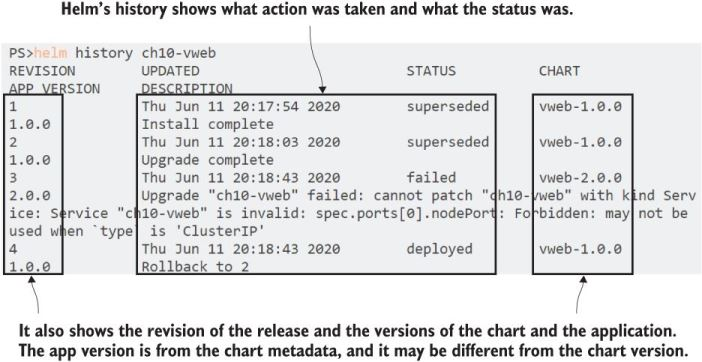

Recommended pattern:

##  1. Install & test the new version

list all installed releases:

```bash
% helm ls -q 
ch10-vweb
```

see which versions are available


```bash
% helm search repo vweb --versions  
NAME       	CHART VERSION	APP VERSION	DESCRIPTION
kiamol/vweb	2.0.0        	2.0.0      	Simple versioned web app
kiamol/vweb	1.0.0        	1.0.0      	Simple versioned web app
```

Install the new version of the app

```bash
# check the values for the new chart version:
helm show values kiamol/vweb --version 2.0.0

helm install --set servicePort=8020 --set replicaCount=1 --set serviceType=ClusterIP ch10-vweb-v2 kiamol/vweb --version 2.0.0
```

After you test the app,

## 2. Uninstall the test release

You can see a list of all releases with `helm list`

```bash
# see a list of releases
helm list
....

helm uninstall ch10-vweb-v2
```

## 3. Perform an upgrade

You can upgrade like this, optionally using the `--reuse-values` and `--atomic` flags:

The `--atomic` flag is important, always use this!  

> with the atomic flag. It waits for all the resource updates to complete, and if any of them fails, it rolls back every other resource to the previous state.  

```bash
helm upgrade --reuse-values --atomic ch10-vweb kiamol/vweb --version 2.0.0
```

:::caution
Always use the `--atomic` flag!
:::


:::caution
When you upgrade, the `--reuse-values` flag will often be handy.  However, this can cause things to break if the api changes between versions.  So use with extreme care!
:::

# Dealing With Failed Upgrades

Get the history.  When you use the `--atomic` flag things will automatically rollback

```bash
helm history ch10-web
```




To fix the failed update, I can manually set all the values in the upgrade command or use a values file with the same settings that are currently deployed. I don’t have that values file, but I can save the output of the get values command to a file and use that in the upgrade, which gives me all my previous settings plus the defaults in the chart for any new settings.

You can get the values like this:

```bash
helm show values kiamol/vweb --version 2.0.0 > myvalues.yaml                                                                          
```

Then you can edit `myvalues.yaml` and use it like this with the `-f` flag:

```bash
helm upgrade -f myvalues.yaml ch10-vweb-v2 kiamol/vweb --version 2.0.0 --dry-run  # take out --dry-run when ready to deploy
```

:::Note]
>It's usually a good idea to use the `--dry-run` flag to sanity check that the generated YAML looks reasonable. 
>


# Rollback

First, see thie history of your releases, which will show you `REVISION` numbers

```bash
helm release history ch10-vweb
```

Rollback to a previous revision

```bash
helm rollback ch10-vweb 2
```

Check the history again, will reflect the rollback.


# Uninstall / Cleanup
```bash
helm uninstall release_name

# uninstall everything DONT DO THIS IN PROD
helm uninstall $(helm ls -q)
```
